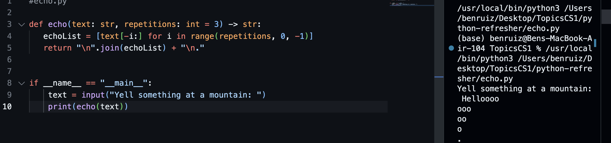
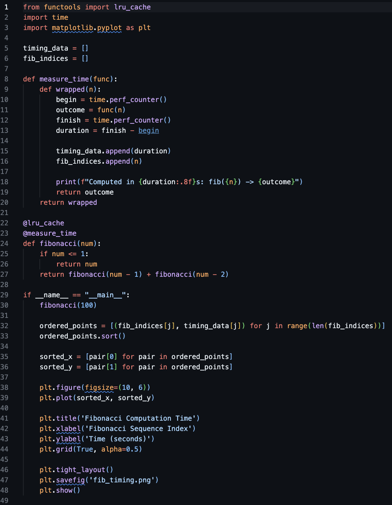
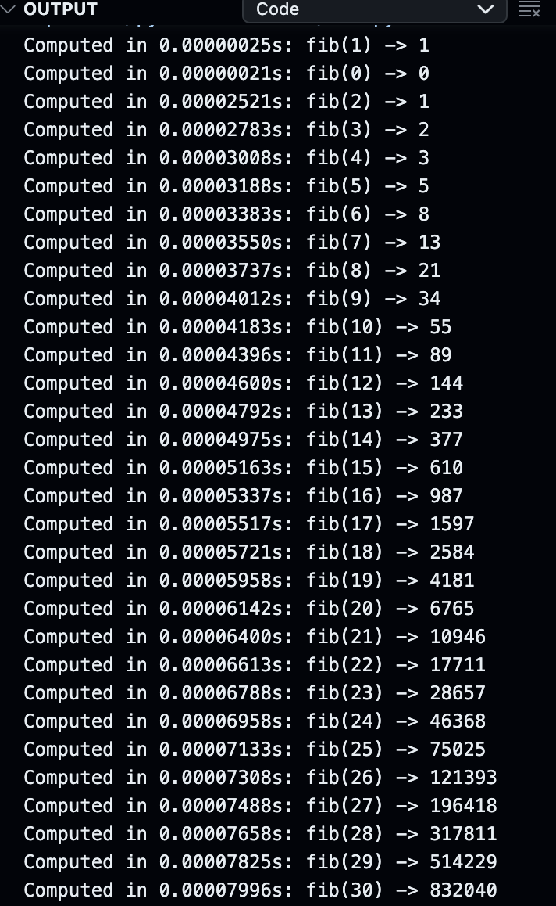
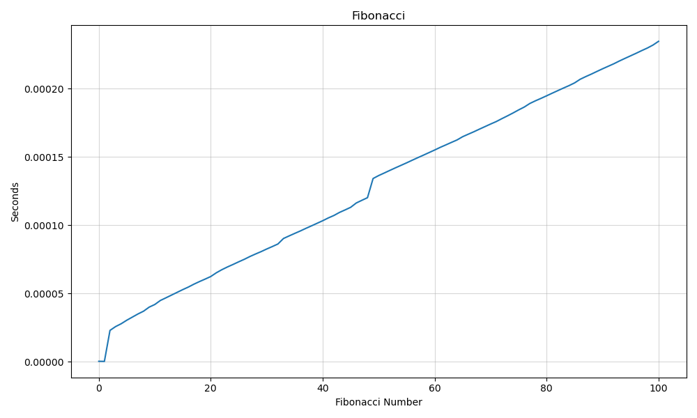

This shows the snippet of my code and the output

This is a snippet of my code for #2

This is a snippet of the output that shows the timer and how fast the fib is being executed

This is the plot that I got that takes the timing for each execution and plots them on the graph. It is incrementing because the larger the number the longer it takes for the execution. This is why you see the graph increasing over time and if it were to go further than 100, it would still continue to rise.